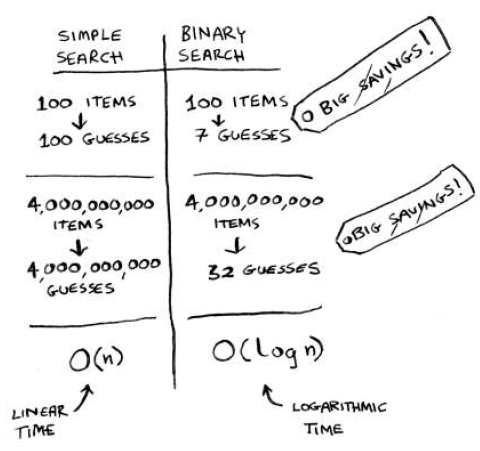

# Binary Search

## How it works ?

If an element you’re
looking for is in that list, binary search returns the position
where it’s located by dividing by half.



### Exercises

- Suppose you have a sorted list of 128 names, and you’re searching
  through it using binary search. What’s the maximum number of
  steps it would take?

> Initial is 128 then 64, 32, 16, 8, 4, 2, 1 - 7 Steps

- Suppose you double the size of the list. What’s the maximum
  number of steps now?

> Initial is 256 then 128, 64, 32, 16, 8, 4, 2, 1 - 8 Steps

### Code example

```
const numbers = [1, 2, 3, 4, 5, 6, 7, 8, 9, 10];

function binarySearch(arr, search, start = 0, end = numbers.length) {
  let mid = Math.floor((start + end) / 2);

  if (end < start) {
    return 'something wrong';
  }

  if (arr[mid] === search) {
    return mid;
  }

  if (arr[mid] < search) {
    return binarySearch(arr, search, mid + 1, end);
  } else {
    return binarySearch(arr, search, start, mid - 1);
  }
}

console.log(binarySearch(numbers, 2));
```
