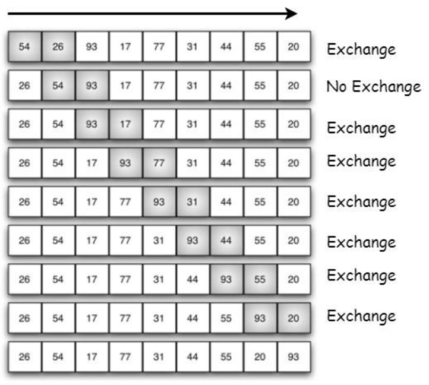

# Bubble Sort

## How it works ?

A bubble sort algorithm goes through a list of data a number of times, comparing two items that are side by side to see which is out of order. It will keep going through the list of data until all the data is sorted into order.




### Code example

```
const numbers = [10, 9, 2, 5, 0, 7, 4, 6, 1, 8, 3];

function bubbleSort(arr) {
  let len = arr.length;
  for (let i = len - 1; i >= 0; i--) {
    for (let j = 1; j <= i; j++) {
      if (arr[j - 1] > arr[j]) {
        let temp = arr[j - 1];
        arr[j - 1] = arr[j];
        arr[j] = temp;
      }
    }
  }
  return arr;
}

console.log(bubbleSort(numbers));
```
