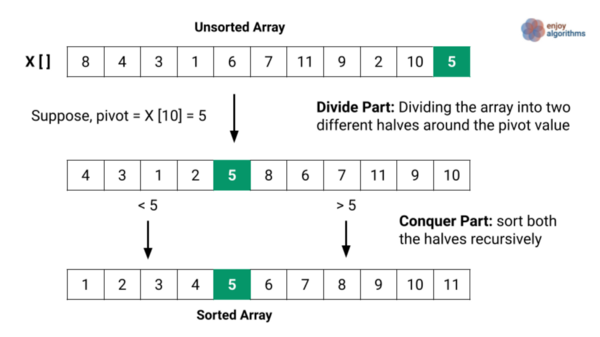

# Quick Sort

## How it works ?

Quicksort using the method D&C (Divide and Conquer). 

Choosing pivot then put it on center and in left side elem which one smaller then pivot, in right side the elem which one bigger then pivot.




### Code example

```
const numbers = [10, 9, 2, 5, 0, 7, 4, 6, 1, 8, 3];

function quickSort(arr) {
  if (arr.length <= 1) {
    return arr;
  }

  let pivot = arr[0];

  let leftArr = [];
  let rightArr = [];

  for (let i = 1; i < arr.length; i++) {
    arr[i] < pivot ? leftArr.push(arr[i]) : rightArr.push(arr[i]);
  }

  return quickSort(leftArr).concat(pivot, quickSort(rightArr));
}

console.log(quickSort(numbers));

```
