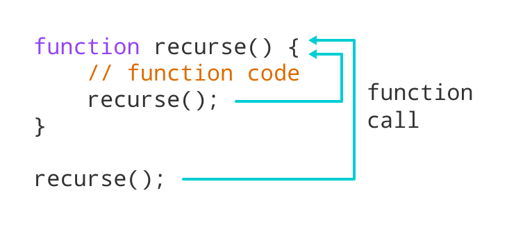

# Recursion

## How it works ?

Recursion is when a function calls itself.

Every recursive function has two cases: the base case
and the recursive case.

- Base case for stop our recursion
- Recursive case to make a recursive function




### Code example

```
const arr = [1, 2, 3, 4, 5, 6, 7, 8, 9, 10];

function findSum(arr, sum = 0, count = 0, max) {
  if (arr.length === 0) {
    return { sum, count, max };
  }

  [head, ...tail] = arr;

  max = Math.max(arr);

  return findSum(tail, (sum += head), (count += 1), max);
}

console.log(findSum(arr));

```
